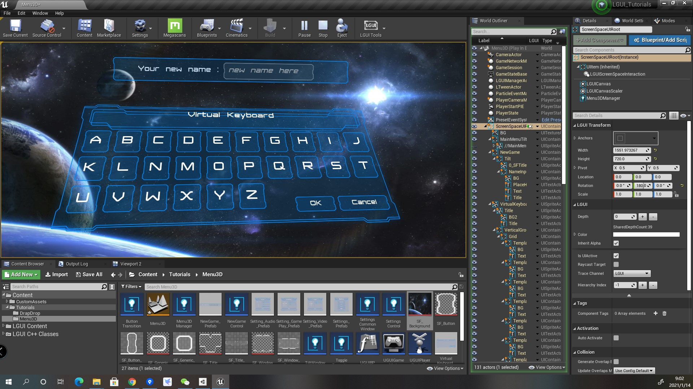
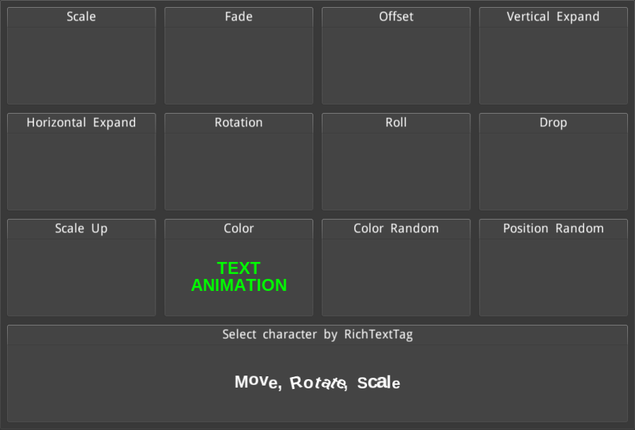
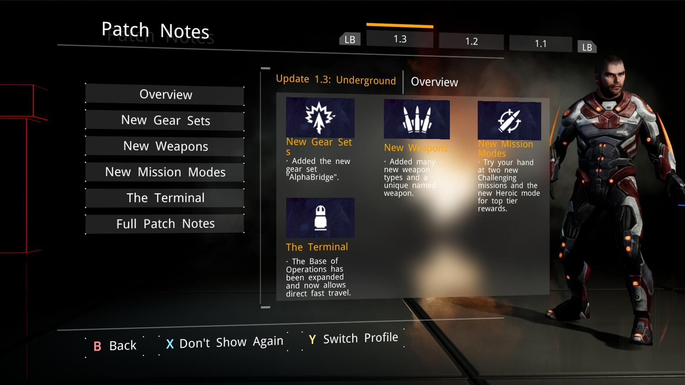
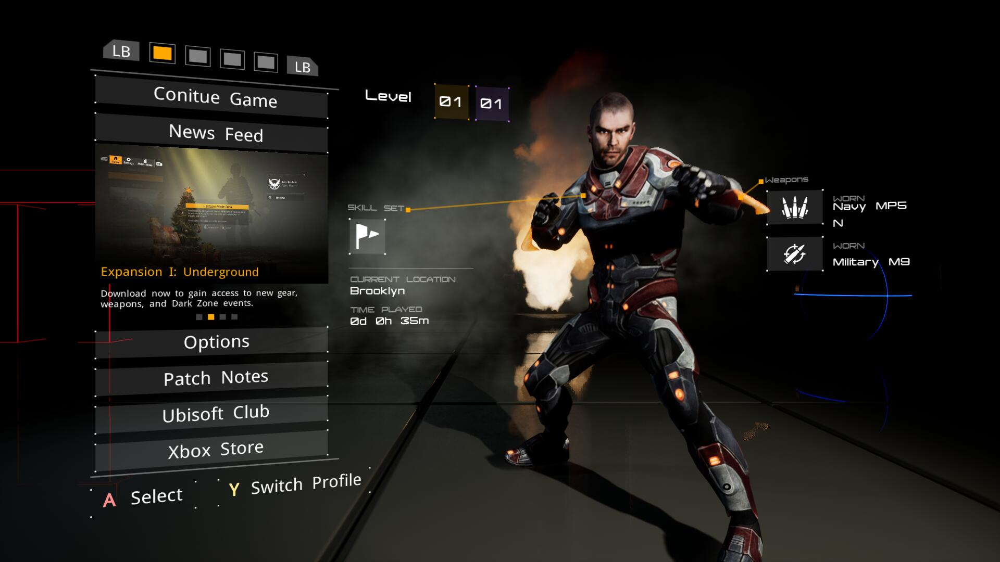
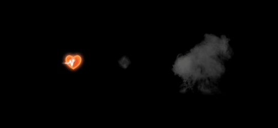
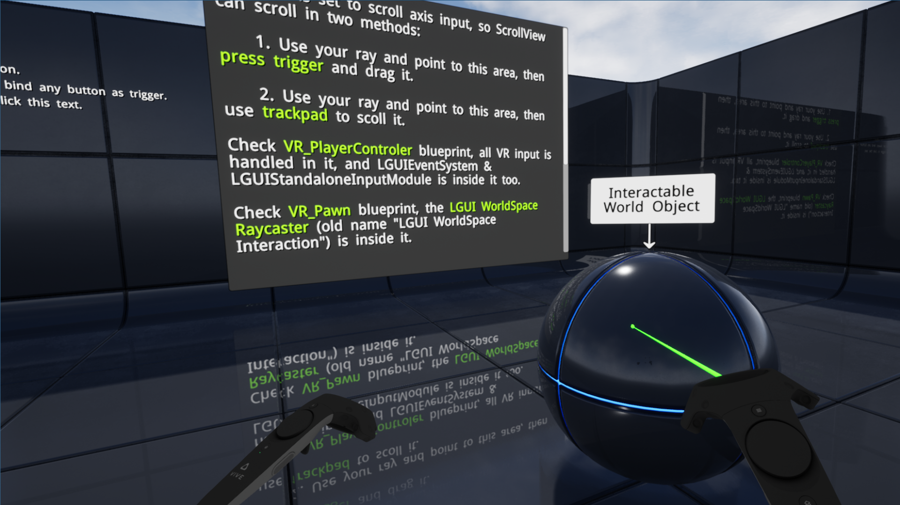

### LGUI tutorial projects.

1. DragDrop  
   
2. Menu3D  
   
3. TextAnimation  
   
4. TheDivision  
   
   
5. ImageSequence  
   
6. Niagara ParticleSystem render  
   
7. VR Template
   
   
8. Blueprint implemented effects: Create Shadow/ LongShadow/ Outline in blueprint.
    
